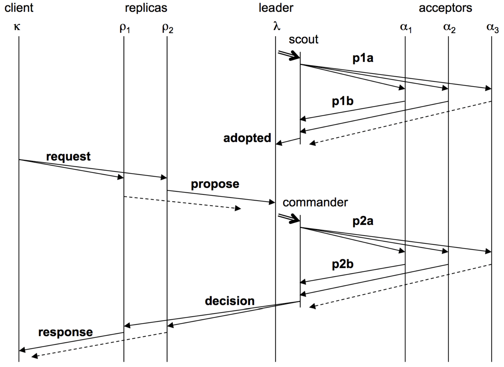
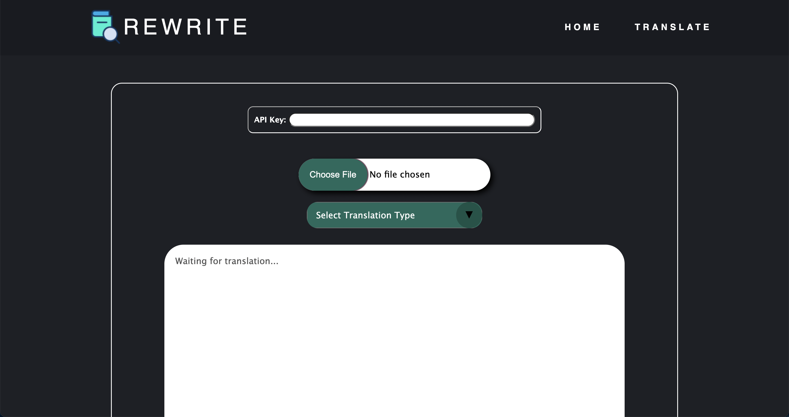
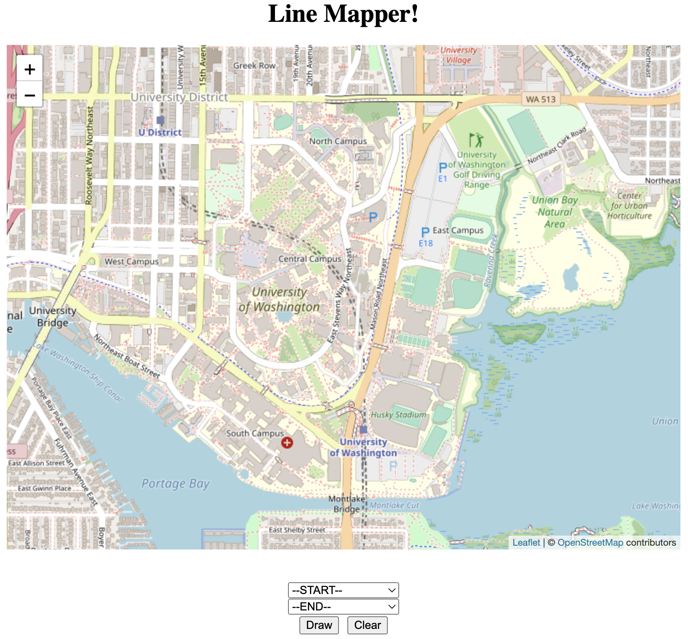

Some of Alden's sample [projects](https://aldenhinden.github.io/UW-Coding-Projects/) from the [UW Paul Allen School of Computer Science](https://www.cs.washington.edu/). 

---

<b>Distributed System:</b> Java Non-Relational Database Similar to Amazon’s DynamoDB or 
Google’s Spanner
 

The quarter-long goal of this project was to build a sharded, linearizable, scalable, fault-tolerant, 
highly available key-value store, with dynamic load balancing and atomic multi-key transactions.

The project was primarily written in Java, beginning with the creation of a personalized key-value store. Fault 
tolerance was attempted first with a primary/backup system, wherein two servers act together to 
guarantee no state is lost or altered from the client's perspective. The client talks to the primary, 
who executes after the backup has processed the request as well. The servers interact with a ViewServer 
who tells them who is primary and who is backup at any given time. Linearizability was guaranteed through "exactly
once" semantics, where clients would retry requests on timers and servers use cached results for already executed 
requests. 

To guarantee linearizability of commands in the event that the ViewServer goes down, a Paxos protocol 
was then implemented. The version implemented in class was adapted from <a href="https://paxos.systems/">this</a> 
paper. In general, clients send requests to all replicas, of which only the leader of the Paxos group processes, 
then broadcasting the request to all other replicas for consensus. Once consensus on the order of commands has 
been reached, the leader processes the request and replies to the client, with the replicas doing the same, all storing 
commands in their own log which is updated by the leader through heartbeat messages. Servers talk to each other through 
a series of messages that each contain their own functionality, and timers are used to solve network latency issues, 
including message delays, reorders, and drops. "Exactly once" semantics are still guaranteed. 

Scalability is addressed by creating a transactional key-value store that can handle sets of client requests, while 
the keys are sharded across the servers using consistent virtual hashing. A ShardMaster manages a sequence of numbered 
configurations describing a set of replica groups and an assignment of shards. Each replica group runs the previously 
implemented Paxos protocol to guarantee linearizability of commands. To help guarantee high availability, the 
ShardMaster will dynamically load balance the store, determining if a new configuration is necessary and redistributing 
shards to new groups as they come and go or as keys become more popular. Lastly, transactions are processed using a 
two-phase commit strategy so that commands can be executed across shard groups. 

The code for this project was written for the class CSE 452: Distributed Systems at UW. Please reach out to me via 
email at aldenhinden@gmail.com or aghs@cs.washington.edu for code. I would be happy to discuss this project further 
as this is a very succinct description, and it was one of my personal favorites. 

 

<b>ReWrite:</b> ChatGPT Integrated PDF Summarizer
 

Full stack development on a team integrating the ChatGPT API into an Angular CLI website, using prompt engineering 
and JavaScript web scraping to return summaries of uploaded PDFs. Experience configuring a virtual private server 
to fully deploy the website using <a href="https://www.vultr.com/">Vultr</a>'s high performance cloud servers. 
Continuous integration and testing experience.

The primary intended use case for this product was to provide users with the ability to summarize complex research 
papers easily. The user visits our website, navigates to the "translate" page, and clicks "upload", providing a PDF 
which they wish to have summarized (note: they must also provide their own API key from OpenAI in the class version). 
They have the option to choose a "quick" translation or a "deep" translation, which will make calls to the ChatGPT API 
either in parallel or sequentially, respectively. 

The website front end was developed using the Angular CLI framework. Uploaded PDFs are scraped using the pdf-parse 
package from Node.js, and the output string is thereafter sent to simplification. After a prompt describing to ChatGPT 
how to summarize is made, the text is broken up into chunks before being sent to ChatGPT through API calls (if "quick" 
mode is enabled, these calls are made in parallel). ChatGPT processes the text chunk-by-chunk before sending the 
result back to the front end. The front end and back end communicate through their respective servers. Continuous 
integration is set up through the Node.js by GitHub Actions using Mocha tests and the Chai testing framework. The 
website was deployed using <a href="https://www.vultr.com/">Vultr</a> to create both a development and production 
version of the website.

The code for this project was written for the class CSE 403: Software Engineering at UW. Please reach out to me via 
email at aldenhinden@gmail.com or aghs@cs.washington.edu for code as I would be happy to discuss this project further.  

 

<b>Campus Map:</b> Pathfinding Resource for the UW Campus
 

Full implementation of Dijkstra’s algorithm to find the shortest path between buildings on UW campus using a 
personalized, generic graph data structure in Java. Front-end UI integration with HTML and ReactJS. Practice 
with simple HTTP servers in Java. 

From the user's perspective, the front end displays a map of the UW campus alongside two drop down menus displaying 
lists of buildings. The user can select a starting point and an ending point, and the UI will display the shortest 
path between those two locations using a purple line. 

The buildings are read from a CSV file into the generic graph data structure. The <code>Graph&#60N, E&#62</code> is a 
wrapper around a <code>HashMap&ltNode&ltN&gt, HashSet&ltEdge&ltE, N&gt&gt&gt</code> and supports the following 
functions: <code>addNode(N label), addEdge(E label, N source, N dest), getNodeList(), getEdgeSet(N parent), 
getParents(N node), getChildren(N node), hasNode(Object o), hasEdge(E label, N source, N dest)</code>. Once the 
buildings are read from CSV file, a graph is constructed mapping building names to their Double coordinates. That 
graph is then sent to the following function that computes the shortest path between two points using Dijkstra's 
algorithm:

<pre>
    <code>
    /**
     * Finds the shortest path between two given nodes on a given graph.
     * @param graph the graph to search through
     * @param startNode the starting node
     * @param destNode the destination node
     * @param &ltT&gt a generic type parameter that represents the graph node type
     * @return the shortest Path between startNode and destNode or null if no path exists
     */
    public static &ltT&gt Path&ltT&gt findShortestPath(Graph&ltT, Double&gt graph, T startNode, T destNode) {
        PriorityQueue&ltPath&ltT&gt&gt active = new PriorityQueue&lt&gt(new PathSorter&lt&gt());
        Set&ltT&gt finished = new HashSet&lt&gt();
        Path&ltT&gt zeroCostPath = new Path&lt&gt(startNode);
        active.add(zeroCostPath);
        while (!active.isEmpty()) {
            Path&ltT&gt minPath = active.remove();
            T minDest = minPath.getEnd();
            if (minDest.equals(destNode)) {
                return minPath;
            }
            if (finished.contains(minDest)) {
                continue;
            }
            for (Graph.Edge&ltDouble, T&gt edge : graph.getEdgeSet(minDest)) {
                if (!finished.contains(edge.dest.label)) {
                    Path&ltT&gt newPath = minPath.extend(edge.dest.label, edge.label);
                    active.add(newPath);
                }
            }
            finished.add(minDest);
        }
        return null;
    }
    </code>
</pre>

The Path object is generated by grabbing user input through a simple Spark server, which takes input from the user for 
"start" and "end" locations, utilizing the <code>findShortestPath()</code> function to return the shortest path to 
the UI to be drawn on the map:

<pre>
    <code>
        // SERVER: find a path between two buildings
        Spark.get("/findPath", (request, response) -> {
            String start = request.queryParams("start");
            String end = request.queryParams("end");
            Path&ltPoint&gt path = campusMap.findShortestPath(start, end);
            Gson gson = new Gson();
            return gson.toJson(path);
        });
    </code>
</pre>

The actual UI is constructed using ReactJS, Node.js, TypeScript, and HTML.

The code for this project was written for the class CSE 331: Software Design & Implementation at UW. Please reach out 
to me via email at aldenhinden@gmail.com or aghs@cs.washington.edu for code as I would be happy to discuss this 
project further.

 

<b>G333gle:</b> C/C++ File System Crawler, Indexer, and Search Engine
 
Created LinkedList and HashMap data structures in C to integrate with C++ index file to serve as back-end of a simple word-matching “mini Google”. Practice with C/C++ HTTP server implementation.

 

<b>PacMan Search:</b> AI Driven Maze Pathfinding in Python
 
Optimizing maze pathfinding in Python with BFS, DFS, UCS, A* search, Alpha-Beta Pruning, and practice with evaluation functions. Further exploration into reinforcement learning with value iteration, Epsilon Greedy, Q-learning, and particle filtering

